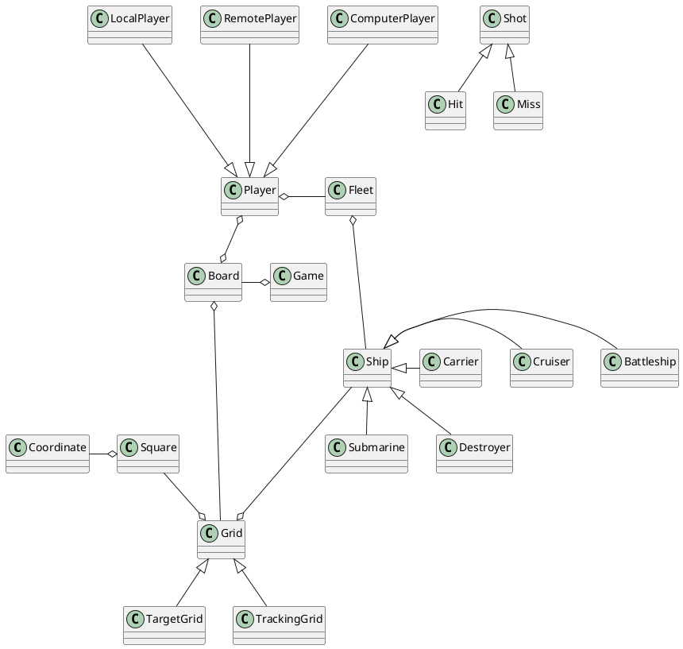

## Domain Dictionary
- Player
- Ship, Vertical Ship, Horizontal Ship
- Ship Position
- Board
- Coordinate
- Square
- (Ocean) Grid
- Upper Grid (Opponent Grid, Target Grid), Lower Grid (Tracking Grid)
- Carrier (5), Battleship (4), Cruiser (3), Submarine (3), Destroyer (2)
- Opponent
- Shot
- Hit (Red)
- Miss (White)
- Peg
- Sunk Ship
- Fleet

## Rules
- [Wikipedia](https://en.wikipedia.org/wiki/Battleship_(game))
- [Rules for Battleship](https://www.cs.nmsu.edu/~bdu/TA/487/brules.htm)
- [How to Play the Battleship Board Game](https://www.thesprucecrafts.com/the-basic-rules-of-battleship-411069)

## Screens

- Welcome Screen
- Decide Who Starts Screen
- Shooting Target Grid Screen