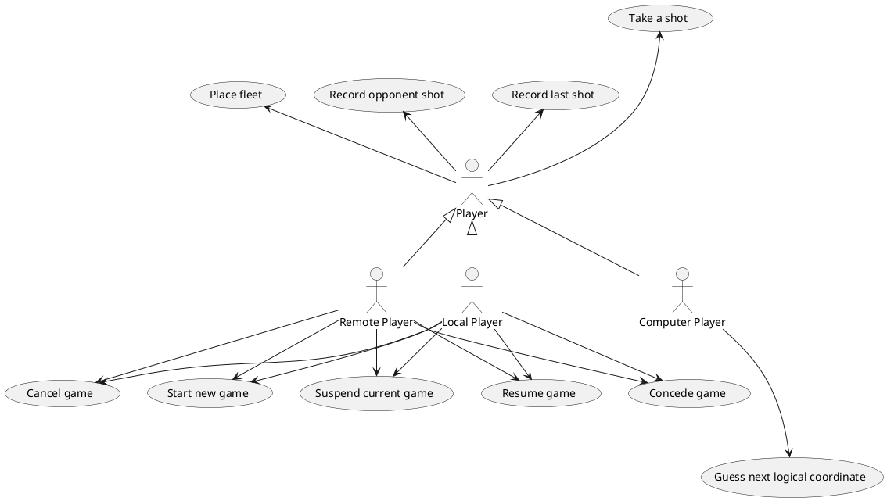

## Use Cases

| Use Case        | Description  |
| ------------- |:-------------|
| Local Player, Remote Player, Computer Player     |  Take Shot |
| Computer Player     |  Guess Next Logical Coordinate |
| Local Player, Remote Player, Computer Player     |  Record Last Shot |
| Local Player, Remote Player, Computer Player     |  Record Opponent Shot |
| Local Player, Remote Player, Computer Player     |  Place Fleet |
| Local Player, Remote Player     |  Start New Game |
| Local Player, Remote Player     |  Suspend Current Game |
| Local Player, Remote Player     |  Resume Game |
| Local Player, Remote Player     |  Concede Game |
| Local Player, Remote Player     |  Cancel Game |

