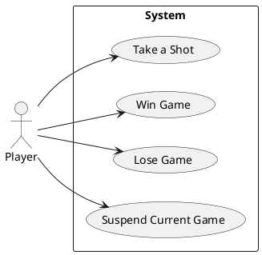

# Take a Shot

## Primary Flow
The system prepares the Target Grid with all the Player's previous Shots. The system presents the Target Grid to the Player. The Player enters a coordinate and clicks "Take a Shot". The system confirms the coordinate belongs to a Target Ship. The system notifies the Player of a Direct Hit and records the Direct Hit. The system's Computer Player begins to <u>Guess the next logical coordinate</u>.

## Alternate Flows
The system confirms the coordinate does NOT belong to a Target Ship. The system notifies the Player of a Miss and records the Miss. The system's Computer Player begins to <u>Guess the next logical coordinate</u>.

The Player clicks Cancel Game. The system <u>Cancels the Game</u>.
The Player clicks Suspend Game. The system <u>Suspends the Game</u>.
The Player clicks Concede Game. The system's Computer Player <u>Wins the Game</u>.

