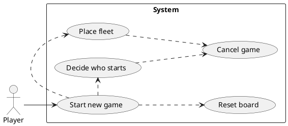

# Start New Game

## Primary Flow
The system displays the Welcome Screen. The Player clicks the New Game button. The system resets the game (<u>Reset Board</u>). The system navigates the Player to the Decide Who Starts Screen.

## Alternate Flows
The system detects a game is in progress. The system prompts the Player to confirm the start of a new Game. The Player confirms. The system resets the game and navigates the Player to the Decide Who Starts Screen.

The system detects a game is in progress. The system prompts the Player to confirm the start of a new Game. The Player cancels. The system returns to the Welcome Screen.

# Reset Board

## Primary Flow
The system resets all Computer Player and Player current game data and status. The system <u>places the Computer Player's Fleet</u> on its Tracking Grid. The system prompts the Player to place his fleet. The Player confirms he would like to continue. The system navigates the Player to the Place Fleet Screen.

## Alternate Flows
The Player clicks Cancel. The system <u>Cancels the Game</u>.

# Place Fleet

## Primary Flow
The system hands the Player a ship to place on the Tracking Grid. The Player places the Ship on the Tracking Grid. The system ensures that the Ship position is legal. The system prompts the Player to place the next Ship.

## Alternate Flows
The Player places the Ship in an illegal positon on the Tracking Board. The system prompts the Player to replace the Ship.

The Player places the last Ship on the Tracking Board. The system notifies the user that the fleet is placed. The system returns control to the parent use case.

The Player clicks Cancel. The system <u>Cancels the Game</u>.

# Cancel Game

## Primary Flow
The Player clicks Cancel. The system displays the Welcome screen.

## Alternate Flows
(none)

# Decide Who Starts

## Primary Flow
The system generates a random number between 1 and 6. The system displays this number to the Player. The Player clicks to generate a random number between 1 and 6. The system determines the Player number is larger and navigates the user to the Shooting Target Grid Screen to <u>Take a shot</u>.

## Alternate Flows
The Player clicks Cancel. The system <u>Cancels the Game</u>.

The System number is larger. The system begins to <u>Guess the next logical coordinate</u>.

The system determines that the numbers are the same and repeats the use case.